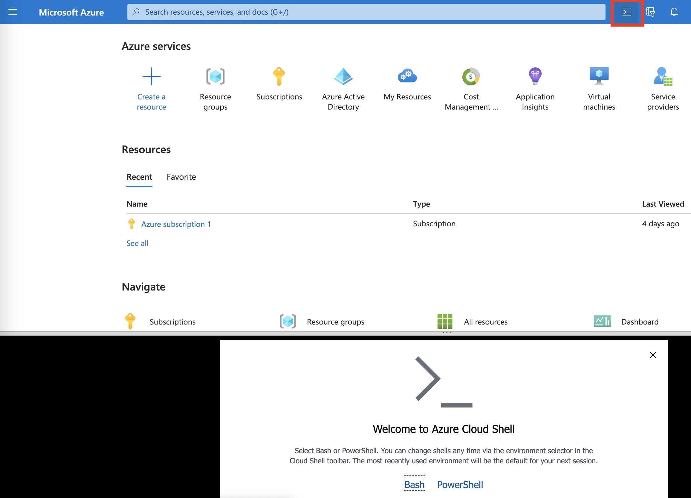

>💡 __Note:__
강사에게 개인 이메일 ID를 제공해야 리소스 그룹 'acme-fitness-rg-asaXX'(XX는 두 자리 숫자)에 대한 접근 권한을 부여할 수 있습니다. 각 리소스 그룹에는 다음과 같은 서비스가 배포되어 있습니다.
 - 
 - Azure Cache for Redis
 - Azure Database for Postgres
 - Azure Key Vault
 - Log Analytics workspace
 - Application Insights workspace


## Setup your environment for the workshop

   1. * [JDK 17](https://docs.microsoft.com/java/openjdk/download?WT.mc_id=azurespringcloud-github-judubois#openjdk-17)
   2. * VSCode, IntelliJ, Eclipse 또는 기타 원하는 IDE를 사용하세요.
   3. * [Azure CLI version 2.46.0 이상](https://docs.microsoft.com/cli/azure/install-azure-cli?view=azure-cli-latest) 다음을 실행하여 현재 Azure CLI 설치 버전을 확인할 수 있습니다:

    ```bash
    az --version
    ```

> Note: Azure CLI를 설치하지 않고도 Azure 포털에서 Cloud Shell을 사용할 수 있습니다. 워크샵의 모든 단계가 Linux를 기반으로 작성되었기 때문에, Cloud Shell은 Windows와 동등한 내용을 읽고 대체하는 데 익숙하지 않은 분들에게 더 쉬울 수 있습니다. Cloud Shell을 사용하려면 Azure Portal에서 오른쪽 위 모서리에 있는 Cloud Shell 버튼을 클릭하면 됩니다.


 
## Azure Portal URL 

[Azure Portal URL](https://portal.azure.com/178a8599-6632-4140-964d-4c3de509a859)

## Azure Spring Apps Enterprise 배포를 위한 환경 준비

`./scripts/setup-env-variables.sh`를 열고 다음의 변수들을 업데이트합니다.:

```shell
export SPRING_APPS_SERVICE=acme-fitness-asa##
export LOG_ANALYTICS_WORKSPACE=acme-fitness-la-asa##]
```

이 환경 파일에는 ARM 템플릿의 일부로 제공된 기본값들이 포함되어 있습니다. 이 워크샵의 목적상 기본값을 그대로 두는 것이 좋습니다. 어떤 이유로든 템플릿에서 이러한 기본값을 업데이트한 경우 여기에 해당 값을 입력해야 합니다.

이제 환경을 설정하세요:

```shell
source ./scripts/setup-env-variables.sh
``` 

### Login to Azure

Azure CLI에 로그인하고 활성 구독을 선택하세요. 

```shell
az login --use-device-code
az account list -o table
az account set --subscription ${SUBSCRIPTION}
```
## Create ASA-E instance

이 섹션에서는 azure cli를 사용하여 ASA-E 인스턴스를 생성하겠습니다.

Azure Spring Apps 서비스의 이름을 준비합니다.  이름은 4자에서 32자 사이여야 하며 소문자, 숫자 및 하이픈만 포함할 수 있습니다.  서비스 이름의 첫 번째 문자는 문자이고 마지막 문자는 문자 또는 숫자 중 하나이어야 합니다.

이 이름은 ```./scripts/setup-env-variables.sh```에 환경 변수 SPRING_APPS_SERVICE로 저장됩니다. 기본값은 acme-fitness-asaXX입니다. 이 워크샵에서는 강사에 의해서 제공된 번호 (예를 들어 03의 경우 acme-fitness-asa03) 를 이용하여 이름을 변경해야 합니다.

### Azure Spring Apps Enterprise 인스턴스 생성

```shell
az spring create --name ${SPRING_APPS_SERVICE} \
    --resource-group ${RESOURCE_GROUP} \
    --location ${REGION} \
    --sku Enterprise \
    --enable-application-configuration-service \
    --enable-service-registry \
    --enable-gateway \
    --enable-api-portal \
    --build-pool-size S2 
```
> 참고: 서비스 인스턴스를 배포하는 데 약 15~20분이 소요됩니다. 위의 명령에서 애플리케이션 구성 서비스, 서비스 레지스트리, 게이트웨이 및 API 포털을 활성화하기 위한 인수가 있음을 알 수 있습니다. 이러한 개별 서비스들은 해당 챕터에서 설명될 예정입니다. 지금은 위의 명령을 실행해 보세요..

다음 명령을 사용하여 기본 리소스 그룹 이름과 클러스터 이름을 설정합니다:

```shell
az configure --defaults \
    group=${RESOURCE_GROUP} \
    location=${REGION} \
    spring=${SPRING_APPS_SERVICE}
```

여기까지의 모든 단계를 완료했다면 다음 리소스를 성공적으로 생성/설치한 것입니다.
* 워크샵에 필요한 모든 종속 리소스는 기 제공됩니다.
* 필수 az cli 확장이 추가되고 기본 구독이 설정됩니다.

### Log Analytics workspace 구성

최근에 만든 Azure 스프링 앱 서비스 및 로그 분석 워크스페이스의 리소스 ID를 검색합니다. 이러한 리소스 ID는 나중에 로그 분석 워크스페이스에 대한 진단 설정을 구성하는 데 사용됩니다:

```shell
export LOG_ANALYTICS_RESOURCE_ID=$(az monitor log-analytics workspace show \
    --resource-group ${RESOURCE_GROUP} \
    --workspace-name ${LOG_ANALYTICS_WORKSPACE} | jq -r '.id')

export SPRING_APPS_RESOURCE_ID=$(az spring show \
    --name ${SPRING_APPS_SERVICE} \
    --resource-group ${RESOURCE_GROUP} | jq -r '.id')
```

Azure 스프링 앱 서비스에 대한 진단 설정을 구성합니다:

```shell
az monitor diagnostic-settings create --name "send-logs-and-metrics-to-log-analytics" \
    --resource ${SPRING_APPS_RESOURCE_ID} \
    --workspace ${LOG_ANALYTICS_RESOURCE_ID} \
    --logs '[
         {
           "category": "ApplicationConsole",
           "enabled": true,
           "retentionPolicy": {
             "enabled": false,
             "days": 0
           }
         },
         {
            "category": "SystemLogs",
            "enabled": true,
            "retentionPolicy": {
              "enabled": false,
              "days": 0
            }
          },
         {
            "category": "IngressLogs",
            "enabled": true,
            "retentionPolicy": {
              "enabled": false,
              "days": 0
             }
           }
       ]' \
       --metrics '[
         {
           "category": "AllMetrics",
           "enabled": true,
           "retentionPolicy": {
             "enabled": false,
             "days": 0
           }
         }
       ]'
```

위의 단계를 성공적으로 완료하면 Azure Spring Apps 엔터프라이즈 인스턴스가 생성됩니다. 이 인스턴스는 다음 섹션에서 모든 서비스/앱을 배포할 컨테이너 역할을 합니다.

---

➡️ Next guide: [01 - Deploy Simple Hello World spring boot app](../02-hol-1-hello-world-app/README.md)