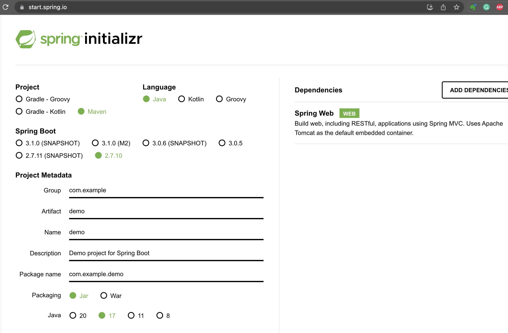
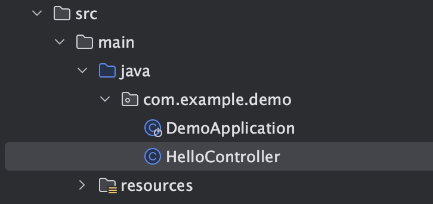
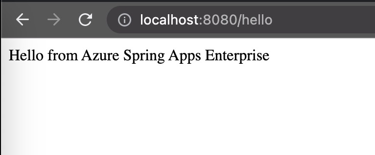
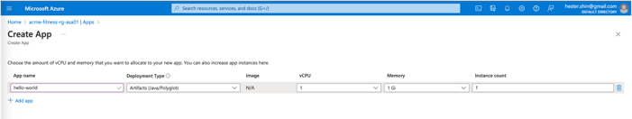
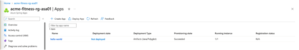
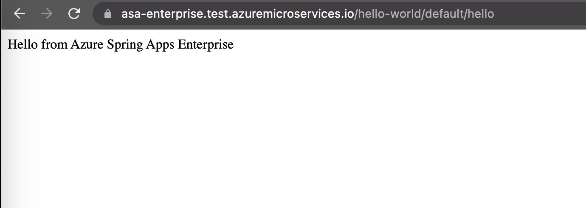

이전 섹션에서는 빈 Azure Spring Apps 인스턴스를 만들었습니다. 이 섹션에서는 아주 간단한 Helloworld 스프링 부팅 앱을 배포하여 ASA-E 에 앱을 배포하고 액세스하는 방법에 대한 기본적인 이해를 얻도록 하겠습니다.

---

## Create a Hello World Spring Boot app

Spring Boot 애플리케이션을 생성하는 일반적인 방법은 [https://start.spring.io/](https://start.spring.io/)에서 Spring 이니셜라이저를 사용하는 것입니다.

>💡 __Note:__ 이 워크샵의 모든 후속 명령은 `cd` 명령으로 달리 표시된 경우를 제외하고 동일한 디렉토리에서 실행해야 합니다..



> 스프링 부트 버전을 2.7.10으로 강제 설정하고 `com.example.demo` 패키지를 사용하는 기본 설정을 유지합니다.

## Add a new Spring MVC Controller

`src/main/java/com/example/demo` 디렉터리에서 다음과 같은 내용으로 `DemoApplication.java` 파일 과 같은 폴더에 `HelloController.java`라는 새 파일을 만들고 다음의 내용을 추가합니다:

```java
package com.example.demo;

import org.springframework.web.bind.annotation.GetMapping;
import org.springframework.web.bind.annotation.RestController;

@RestController
public class HelloController {

    @GetMapping("/hello")
    public String hello() {
        return "Hello from Azure Spring Apps Enterprise\n";
    }
}
```


## Test the project locally

프로젝트를 실행합니다:

```bash
cd hello-world
./mvnw spring-boot:run &
cd ..
```

`/hello` 엔드포인트를 요청하면 "Hello from Azure Spring Apps" 메시지가 반환되어야 합니다.



마지막으로 실행 중인 앱을 종료합니다:

위의 단계를 통해 Hello World 앱이 로컬에서 문제 없이 실행되고 있는지 확인합니다.

## Azure Spring Apps 인스턴스에서 애플리케이션 생성 및 배포

### 옵션 1 - Azure 포털에서 앱 인스턴스 만들기





### 옵션 2 - Azure CLI에서 앱 인스턴스 만들기

아래 명령을 사용하여 cli에서 앱 인스턴스를 생성합니다:

```bash
az spring app create -n hello-world
This command usually takes minutes to run. Add '--verbose' parameter if needed.
[1/3] Creating app hello-world
[2/3] Creating default deployment with name "default"
[3/3] Updating app "hello-world" (this operation can take a while to complete)
App create succeeded
...
```

이제 "hello-world" 프로젝트를 빌드하고 Azure Spring Apps Enterprise에 배포할 수 있습니다.:

```bash
az spring app deploy -n hello-world --build-env BP_JVM_VERSION=17 --source-path .
```

이렇게 하면 로컬 디스크에 jar 파일이 생성되고 이전 단계에서 생성한 앱 인스턴스에 업로드됩니다.  `az` 명령은 결과를 JSON으로 출력합니다.  지금 당장은 이 출력에 주의를 기울일 필요는 없지만 나중에 진단 및 테스트 목적으로 유용하게 사용할 수 있습니다.

## 클라우드에서 프로젝트 테스트

[the Azure portal](https://portal.azure.com/) 로 이동합니다:

- 리소스 그룹에서 Azure Spring Apps 인스턴스를 찾습니다.
- 탐색 창의 "설정" 섹션에서 "앱"을 클릭하고 "헬로월드"를 선택합니다.
- "필수" 섹션에서 "테스트 엔드포인트"를 찾습니다.

- 이렇게 하면 다음과 같은 내용이 표시됩니다:
  `https://primary:<REDACTED>@hello-world.test.azuremicroservices.io/hello-world/default/`
  >💡 `https://` 과 `@` 사이의 텍스트에 유의하세요.  이는 기본 인증 자격 증명이며, 이 자격 증명이 없으면 서비스에 액세스할 수 없습니다. N
- URL에 `hello/`를 추가합니다.  이렇게 하지 않으면 "404 찾을 수 없음"이 표시됩니다.

이제 웹 브라우저를 사용하여 이번에는 Azure Spring Apps에서 제공하는 `/hello` 엔드포인트를 테스트할 수 있습니다.



성공하면 다음과 같은 메시지가 표시됩니다.: `Hello from Azure Spring Apps Enterprise`.

## 로그 확인하기s

```shell
az spring app logs -s ${SPRING_APPS_SERVICE} -g ${RESOURCE_GROUP} -n hello-world -f
```

## 어플리케이션 Scale out

```shell
az spring app scale -n hello-world --instance-count 3
```
이 명령이 성공적으로 완료되면 Azure 포털에서 실행 중인 인스턴스 수가 기본 1에서 3으로 업데이트된 것을 확인할 수 있습니다.


## 헬로월드 앱 삭제
헬로월드 앱을 성공적으로 테스트했다면 리소스를 절약하기 위해 앱을 삭제하세요. 이 앱을 삭제하려면 아래 명령어를 사용하세요.

```bash
az spring app delete --name hello-world
```
## 결론

축하합니다, 첫 번째 Spring Boot 앱을 Azure Spring Apps에 배포했습니다! 이제 다음 단계로 넘어가서 Azure Spring Apps에서 프론트 엔드 앱을 배포해 보겠습니다.

---

➡️ Previous guide: [01 - Deploy Simple Hello World spring boot app](../02-hol-1-hello-world-app/README.md)

➡️ Next guide: [03 - Hands On Lab 2 - Deploy Frontend app](../03-hol-2-deploy-frontend-app/README.md)
