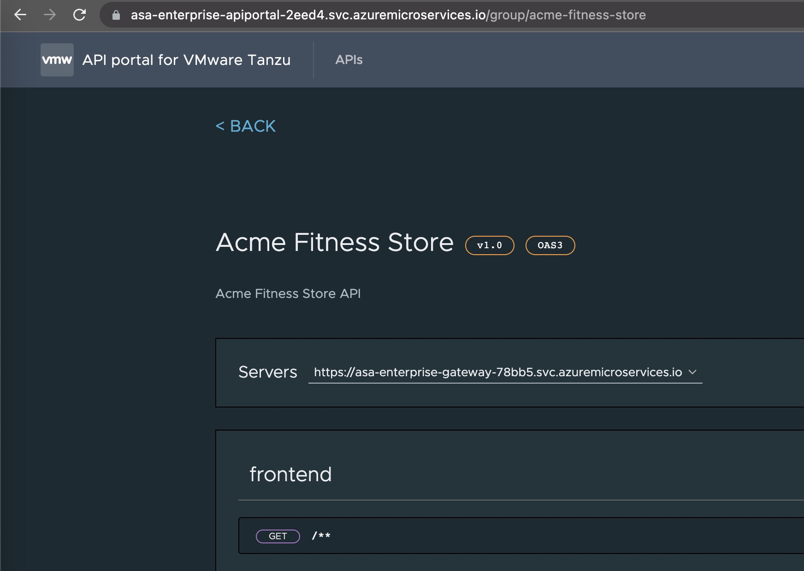

이전 섹션에서는 간단한 헬로월드 서비스를 ASA Enterprise 인스턴스에 배포했습니다. 이 섹션에서는 acme-fitness의 프론트엔드를 배포하고 Spring Cloud Gateway로 구성한 후 프론트엔드에 액세스할 수 있는지 확인하겠습니다.

아래 다이어그램은 이 섹션이 완료된 후에 최종 결과물를 보여줍니다.:


다음은 서비스/앱을 성공적으로 배포하기 위해 구성/생성하는 다양한 단계입니다.
- [1. Configure sampling rate for Application Insights](#1-configure-sampling-rate-for-application-insights)
  - [1.1. Update Sampling Rate](#11-update-sampling-rate)
- [2. Create and Deploy frontend application in Azure Spring Apps](#2-create-and-deploy-frontend-application-in-azure-spring-apps)
- [3. Configure Spring Cloud Gateway](#3-configure-spring-cloud-gateway)
  - [3.1. Create  routing rules for the applications:](#31-create--routing-rules-for-the-applications)
- [4. Access the Application through Spring Cloud Gateway](#4-access-the-application-through-spring-cloud-gateway)
- [5. Explore the API using API Portal](#5-explore-the-api-using-api-portal)


## 1. Configure sampling rate for Application Insights

이 단계는 프런트엔드 앱 배포와 관련이 없는 예비 단계입니다. 그러나 앱을 배포하기 전에 필요한 모든 정보로 애플리케이션 인사이트가 구성되어 있는지 확인하기 위한 것입니다. 애플리케이션 인사이트에 대한 자세한 내용은 섹션 14에서 설명합니다.

`./scripts/setup-keyvault-env-variables.sh`를 열고 다음 정보를 업데이트합니다.:

```shell
export KEY_VAULT=acme-fitness-kv-asaXX
```

그런 다음 환경을 설정합니다.:

```shell
source ./scripts/setup-keyvault-env-variables.sh
```

애플리케이션 인사이트를 위한 Instrumentation Key를 검색하여 키 보관소에 추가하세요.

```shell
export INSTRUMENTATION_KEY=$(az monitor app-insights component show --app ${SPRING_APPS_SERVICE} --query 'connectionString' -otsv)

az keyvault secret set --vault-name ${KEY_VAULT} \
    --name "ApplicationInsights--ConnectionString" --value ${INSTRUMENTATION_KEY}
```

### 1.1. Update Sampling Rate

아래 명령을 실행하기 전에 기존에 실행 중인 애플리케이션이 없는지 확인하세요. 실행 중인 애플리케이션이 있으면 빌드팩 빌더를 업데이트하는 데 충돌이 발생할 수 있습니다. 기존 애플리케이션이 있는 경우 Azure 포털에서 Azure Spring 앱 인스턴스로 이동하여 앱 섹션으로 이동하여 삭제할 수 있습니다.

애플리케이션 인사이트 바인딩의 샘플링 속도를 높입니다.

```shell
az spring build-service builder buildpack-binding set \
    --builder-name default \
    --name default \
    --type ApplicationInsights \
    --properties sampling-rate=100 connection_string=${INSTRUMENTATION_KEY}
```

## 2. Create and Deploy frontend application in Azure Spring Apps

첫 번째 단계는 각 서비스에 대한 애플리케이션을 만드는 것입니다:

```shell
az spring app create --name frontend --instance-count 1 --memory 1Gi
```

위의 단계가 완료되면 앱을 배포해야 합니다.

```shell
az spring app deploy --name frontend \
    --source-path ./apps/acme-shopping 
```

## 3. Configure Spring Cloud Gateway

Public 엔드포인트를 할당하고 API 정보로 Spring Cloud Gateway 구성을 업데이트하세요:

```shell
az spring gateway update --assign-endpoint true

export GATEWAY_URL=$(az spring gateway show --query "properties.url" -otsv)
```
assign-endpoint 변수는 게이트웨이에 공개적으로 액세스할 수 있는 엔드포인트를 만듭니다.

```shell
az spring gateway update \
    --api-description "Acme Fitness Store API" \
    --api-title "Acme Fitness Store" \
    --api-version "v1.0" \
    --server-url "https://${GATEWAY_URL}" \
    --allowed-origins "*"
```

### 3.1. Create  routing rules for the applications:

라우팅 규칙은 엔드포인트를 백엔드 애플리케이션에 바인딩합니다. 아래 단계에서는 SCG에서 프론트엔드 앱에 대한 규칙을 생성합니다. 프론트엔드 앱은 SCG를 통해 액세스할 수 있습니다.

```shell

az spring gateway route-config create \
    --name frontend \
    --app-name frontend \
    --routes-file ./routes/frontend.json

```

## 4. Access the Application through Spring Cloud Gateway

Spring Cloud Gateway의 URL을 검색하여 브라우저에서 엽니다:

```shell
echo "https://${GATEWAY_URL}"
```

아래와 같이 acme-fitness 홈 페이지가 표시되면 정상적으로 앱 배포가 완료된 것입니다. 축하드립니다. 프론트엔드 앱과 SCG의 해당 경로가 올바르게 구성되고 성공적으로 배포되었습니다. 애플리케이션을 살펴볼 수 있지만, 아직 모든 기능이 작동하는 것은 아닙니다. 다음 섹션을 계속 진행하여 나머지 기능을 구성하세요.


## 5. Explore the API using API Portal

API 포털에 엔드포인트를 할당하고 브라우저에서 열기:

```shell
az spring api-portal update --assign-endpoint true

export PORTAL_URL=$(az spring api-portal show --query "properties.url" -otsv)

echo "https://${PORTAL_URL}"
```
브라우저를 열고 PORTAL_URL로 이동합니다. 아래와 같이 API 포털이 표시됩니다.


➡️ Previous guide: [02 - Deploy Simple Hello World spring boot app](../02-hol-1-hello-world-app/README.md)

➡️ Next guide: [04 - Hands On Lab 3.1 - Deploy backend apps](../04-hol-3.1-deploy-backend-apps/README.md)