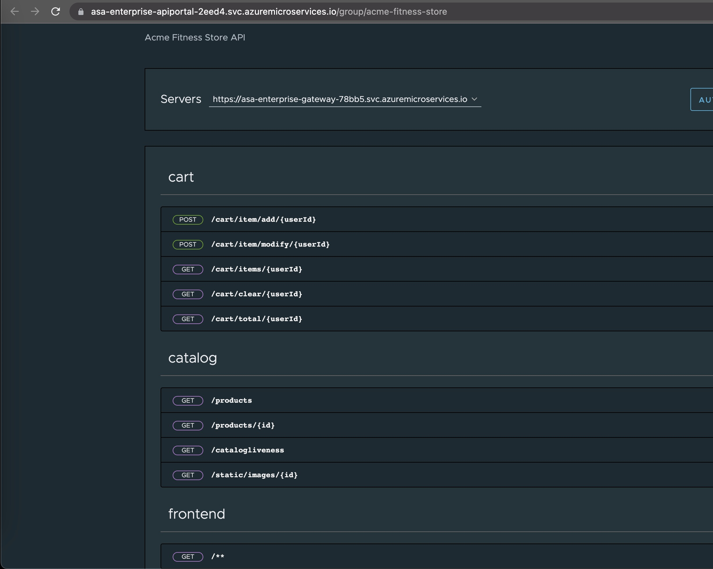

이 섹션에서는 acme-fitness 애플리케이션을 위한 백엔드 앱을 배포하겠습니다. 또한 스프링 클라우드 게이트웨이에서 이러한 백엔드 앱에 대한 규칙을 업데이트합니다.

아래 다이어그램은 이 섹션이 완료된 이후에 최종 결과를 보여줍니다:


다음은 서비스/앱을 성공적으로 배포하기 위해 구성/생성하는 다양한 단계입니다.
- [1. Create backend apps](#1-create-backend-apps)
- [2. Deploy backend apps](#2-deploy-backend-apps)
- [3. Create  routing rules for the backend apps:](#3-create--routing-rules-for-the-backend-apps)


## 1. Create backend apps

첫 번째 단계는 각 서비스에 대한 애플리케이션을 생성하는 것입니다. 아래와 같이 shell 을 이용하거나 Azure Portal 을 이용하여 생성할 수 있습니다

```shell
az spring app create --name cart-service --instance-count 1 --memory 1Gi

az spring app create --name order-service --instance-count 1 --memory 1Gi

az spring app create --name payment-service --instance-count 1 --memory 1Gi

az spring app create --name catalog-service --instance-count 1 --memory 1Gi
```
위 단계가 성공적으로 완료되면 아래와 같이 ASA-E 인스턴스에 나열된 모든 백엔드 앱이 표시되어야 합니다.


## 2. Deploy backend apps

이제 필요한 모든 앱이 생성되었으므로 다음 단계는 서비스/앱을 배포하는 것입니다. 이를 위해서는 서비스의 소스 코드에 액세스할 수 있어야 합니다.

```shell
# Deploy Payment Service
az spring app deploy --name payment-service \
    --config-file-pattern payment/default \
    --build-env BP_JVM_VERSION=17 \
    --source-path ./apps/acme-payment

# Deploy Catalog Service
az spring app deploy --name catalog-service \
    --config-file-pattern catalog/default \
    --build-env BP_JVM_VERSION=17 \
    --source-path ./apps/acme-catalog 

# Deploy Order Service
az spring app deploy --name order-service \
    --source-path ./apps/acme-order 

# Deploy Cart Service 
az spring app deploy --name cart-service \
    --env "CART_PORT=8080" \
    --source-path ./apps/acme-cart 
```

So far in this section we were able to successfully create and deploy the apps into an existing azure spring apps instance. 

## 3. Create  routing rules for the backend apps:

라우팅 규칙은 요청의 엔드포인트를 백엔드 애플리케이션에 바인딩합니다. 예를 들어 아래 장바구니 경로에서 라우팅 규칙은 /cart/** 엔드포인트에 대한 모든 요청이 백엔드 장바구니 앱으로 라우팅됨을 나타냅니다.

```shell
az spring gateway route-config create \
    --name cart-service \
    --app-name cart-service \
    --routes-file ./routes/cart-service.json
    
az spring gateway route-config create \
    --name order-service \
    --app-name order-service \
    --routes-file ./routes/order-service.json

az spring gateway route-config create \
    --name catalog-service \
    --app-name catalog-service \
    --routes-file ./routes/catalog-service.json

```

이로써 모든 백엔드 앱의 성공적인 배포와 SCG에서 이러한 앱에 대한 규칙 업데이트가 완료됩니다.

```shell
echo "https://${PORTAL_URL}"
```



⬅️ Previous guide: [03 - Hands On Lab 2 - Deploy Frontend app](../03-hol-2-deploy-frontend-app/README.md)

➡️ Next guide: [05 - Hands On Lab 3.2 - Bind Apps to ACS and Service Registry](../05-hol-3.2-bind-apps-to-acs-service-reg/README.md)